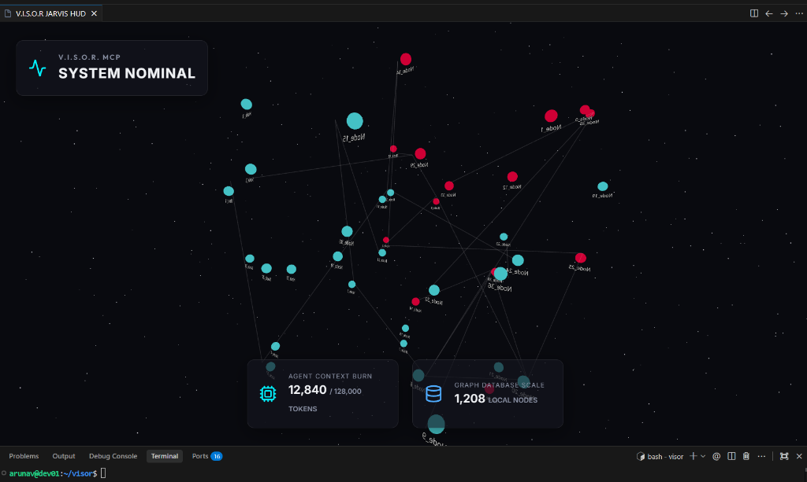
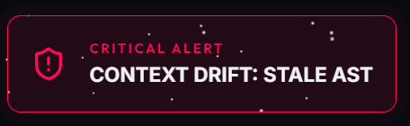

# V.I.S.O.R. (Visual Intelligence System for Orchestrated Reasoning)

[](https://github.com/dibun75/visor) [](LICENSE) [](pyproject.toml) [](https://modelcontextprotocol.io)

V.I.S.O.R. is a local-first, privacy-focused Model Context Protocol (MCP) server and 3D Developer HUD for AI-native IDEs like Google Antigravity and VS Code. It acts as a "second brain" for your AI coding agents, providing them with persistent memory and **precise, semantically-ranked codebase context** while drastically reducing your API token costs.

<div align="center">
  
</div>

---

## ✨ Features

* **Interactive 3D WebGPU HUD**: Monitor your AI agents in real-time without leaving your IDE. The HUD visualises your codebase architecture as a force-directed graph and displays live telemetry, including your Agent Context Burn and Graph Database Scale.
* **Context Intelligence Engine**: V.I.S.O.R.'s `build_context` tool goes beyond simple search. It uses a multi-signal relevance scoring formula combining embedding similarity, exact symbol matching, co-location, and dependency graph distance to rank and compress the most relevant code into a token-budget-aware payload.
* **Semantic AST Indexing**: Powered by Tree-sitter (Python, TypeScript, JavaScript), V.I.S.O.R. parses your codebase into an Abstract Syntax Tree. Symbol definitions are embedded using `all-MiniLM-L6-v2` and stored in a local SQLite vector store for instant semantic retrieval.
* **Persistent Agentic Memory**: A local SQLite database with `sqlite-vec` remembers past architectural decisions, user preferences, and custom rules across different chat sessions.
* **Dual-Mode Drift Detection**: V.I.S.O.R. detects stale context via **SHA-256 hash comparison** (exact) or **file changelog timestamps** (fallback), warning agents before they hallucinate based on outdated code.
* **Hash-based Indexing Cache**: Unchanged files are never re-embedded. The file watcher compares SHA-256 hashes before triggering the (expensive) embedding pipeline.

<div align="center">
  
</div>

---

## 🧠 Core Philosophy & Architecture

### How V.I.S.O.R. Saves Tokens
V.I.S.O.R. eliminates **"orientation waste"**. Instead of the AI using standard grep tools and blindly reading dozens of irrelevant files to understand how components fit together, our MCP server queries the local Tree-sitter knowledge graph. It passes surgical dependency chains directly to the model, ensuring the AI only reads what is strictly necessary.

### Why We Track 'Context Burn' instead of 'Tokens Saved'
Claiming massive "75x token savings" by comparing a graph query against the size of the entire repository is a misleading vanity metric, because modern AI coding tools never actually load the full repo per prompt anyway. The real issue is that roughly 60% of tokens per prompt are wasted on reading the wrong files during the agent's search phase. To remain fully transparent, our HUD displays real-time **Agent Context Burn** rather than a fabricated "savings" metric, helping developers manage their actual session limits contextually.

### Data Privacy and Secure OAuth Integration
V.I.S.O.R. acts as a local data provider, completely bypassing the risks of a network proxy. It communicates with the Antigravity IDE (and others) entirely locally over standard input/output (stdio). **It never intercepts outbound internet traffic and does not touch the user's Google OAuth tokens.** Your IDE simply requests optimized context from V.I.S.O.R. locally, and then the IDE securely bundles that context with your prompt to send to the cloud using its own authorized connection.

---

## 🚀 Quick Start (IDE Extension)

V.I.S.O.R. is distributed as a native IDE extension, bundling both the Python backend engine and the React WebGPU frontend.

1. Download the latest `visor-hud-0.7.0.vsix` release.
2. Open your IDE (Antigravity or VS Code) and navigate to the Extensions panel.
3. Click the `...` menu at the top right and select **Install from VSIX...**.
4. Select the downloaded `.vsix` file.
5. The extension will automatically use `uv` to bootstrap the Python MCP server and launch the HUD in your sidebar via the *Start V.I.S.O.R. HUD* command.

> **Note**: First launch downloads the `all-MiniLM-L6-v2` embedding model (~80MB) from HuggingFace. Subsequent starts are instant (model is cached locally).

---

## 📊 Understanding the HUD & Telemetry

V.I.S.O.R operates entirely via the **Model Context Protocol (MCP)** boundary. It uses precision tooling rather than passively intercepting your raw chat prompts. 

* **Agent Context Burn**: A real-time token tracker showing the volume of context permanently stored by your agent. This number only increments horizontally when your AI explicitly invokes the `store_memory` MCP tool to commit knowledge to the database.
* **Graph Database Scale**: The total number of AST nodes (functions, classes, imports) currently indexed in your local SQLite vector store. This local metric only increments when you write new logic in tracked files, triggering the AST indexing pipeline.
* **Context Drift Alert**: Flashes red if the agent's internal contextual understanding is outdated. V.I.S.O.R watches the file system; if you physically modify a source file, the warning trips active for exactly 60 seconds to warn the LLM before it hallucinates via stale code references.
* **System Status Indicator**: A non-obtrusive data sync monitor in the 3D Graph layout. It pulses "SYNCING..." while querying the SQLite database for codebase topology, and locks to a solid green "SYSTEM LIVE" when your AST rendering is visually up to date.

---

## 🛠️ MCP Tool Suite

With version `0.5.0`, V.I.S.O.R. exposes a full **Context Intelligence Engine** with 16 MCP tools across 5 categories. For the complete API reference see [`docs/MCP_TOOLS.md`](./docs/MCP_TOOLS.md).

### 🧠 Intelligence
| Tool | Description |
|------|-------------|
| `build_context(query)` | **Ranked, compressed context** from a natural language query. Multi-signal scoring: embedding similarity + exact match + co-location + dependency proximity. Token-budget enforced (8k cap). |

### 🔍 Search
| Tool | Description |
|------|-------------|
| `search_codebase(query)` | Pure semantic vector search across indexed AST nodes |
| `get_symbol_context(symbol)` | All definitions of a symbol with file + line range |
| `get_file_context(path)` | Full AST symbol listing for a file |

### 🗺️ Graph Analysis
| Tool | Description |
|------|-------------|
| `get_dependency_chain(symbol)` | Transitive import chain from a symbol's source file (BFS depth 5) |
| `impact_analysis(file_path)` | Downstream blast radius of a file change |
| `trace_route(source, target)` | Shortest architectural path between two files |
| `dead_code_detection()` | Files with no incoming dependency edges |

### ⚠️ Drift Detection
| Tool | Description |
|------|-------------|
| `get_drift_report(files, loaded_at, file_hashes?)` | Hash-based or timestamp-based context drift detection |

### 🧩 Memory & Custom Skills
| Tool | Description |
|------|-------------|
| `store_memory(role, content)` | Persist conversation turn with semantic embedding |
| `get_visor_skill(name)` | Fetch a custom AI instruction pack |
| `list_custom_skills()` | List all available custom skills |
| `add_custom_skill(name, desc, content)` | Create a custom skill via API |
| `delete_custom_skill(id)` | Remove a custom skill |

**Example Chat Invocations:**
```
"Use build_context to find the most relevant code for handling user authentication."
"Use get_symbol_context to find where VectorDBClient is defined."
"Use get_dependency_chain on 'index_file' to see what it imports."
"Use get_drift_report to check if any of my context files have changed."
"Fetch the backend-expert skill using get_visor_skill."
```

## 🔌 Wiring it to Your AI Agent (Antigravity)

V.I.S.O.R's extension provides the frontend metrics HUD, but your IDE's innate AI engine still needs to be pointed to V.I.S.O.R's daemon to gain the capability to actually call its tools!

For Google Antigravity, MCP connections are declared centrally inside your home directory.

1. Open `~/.gemini/antigravity/mcp_config.json`.
2. Append V.I.S.O.R to the active `mcpServers` dictionary:
```json
    "visor": {
      "command": "uv",
      "args": [
        "--directory",
        "<PATH_TO_VISOR_WORKSPACE>",
        "run",
        "-q",
        "<PATH_TO_VISOR_WORKSPACE>/src/visor/server.py"
      ],
      "env": {}
    }
```
3. Restart or reload your AI Agent session.
4. Try prompting your agent: *"Please use the `store_memory` tool to save 'Hello World'"*. You will immediately notice the Agent Context Burn jump up as the AI fulfills the MCP contract!

---

## 🐛 Common Webview Pitfalls

If you are developing the WebGPU HUD or contributing to V.I.S.O.R., please note the following quirks regarding VS Code Webview Main Panels:
* **`acquireVsCodeApi()` Restriction**: VS Code imposes a strict security constraint where the `acquireVsCodeApi()` method can only be called **exactly once** per Webview lifecycle. Attempting to call it repeatedly (for example, directly inside a React component body that re-renders) will throw a fatal `An instance of the VS Code API has already been acquired` error. This error will silently crash the React tree without triggering standard browser debuggers. Always memoize or cache the VS Code API object globally on initial mount.

---

## 📚 Documentation

| Document | Description |
|----------|-------------|
| [`docs/ARCHITECTURE.md`](./docs/ARCHITECTURE.md) | Full system design, data flow, DB schema, and how to extend V.I.S.O.R. |
| [`docs/MCP_TOOLS.md`](./docs/MCP_TOOLS.md) | Complete MCP tool API reference for AI agents and developers |

---

## 🤝 Contributing

V.I.S.O.R. is built by the community, for the community. We recommend sharing short video demos of specific HUD features on social media to help others see the value of token optimization. Check our issues page to submit feature requests or report bugs.

### Development Setup

```bash
# Clone and install
git clone https://github.com/dibun75/visor.git
cd visor
uv sync

# Run the MCP server directly
uv run src/visor/server.py

# Build the HUD
cd src/visor/hud && npm install && npm run build

# Build the extension
cd src/visor/extension && npm install && npm run compile
npx @vscode/vsce package -o visor-hud-0.7.0.vsix
```
