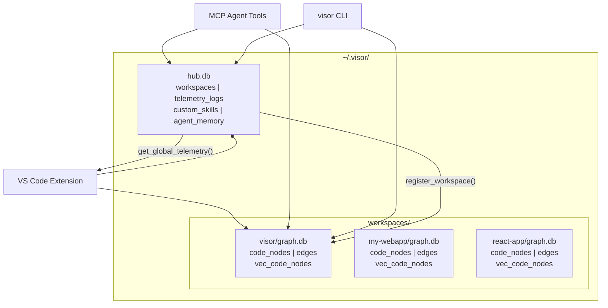

# V.I.S.O.R. Technical Architecture

> **V**isual **I**ntelligence **S**ystem for **O**rchestrated **R**easoning

## Table of Contents

1. [System Overview](#system-overview)
2. [Design Philosophy](#design-philosophy)
3. [Hub-and-Spoke Database Architecture](#hub-and-spoke-database-architecture)
4. [Data Flow](#data-flow)
5. [Database Schema](#database-schema)
6. [Component Breakdown](#component-breakdown)
7. [Embedding Pipeline](#embedding-pipeline)
8. [Context Scoring Engine](#context-scoring-engine)
9. [MCP Server & Tool Registration](#mcp-server--tool-registration)
10. [IDE Extension & WebGPU HUD](#ide-extension--webgpu-hud)
11. [Security Model](#security-model)
12. [How to Extend V.I.S.O.R.](#how-to-extend-visor)

---

## System Overview

V.I.S.O.R. is a **local-first MCP (Model Context Protocol) server** that acts as a semantic knowledge graph for AI coding agents. It indexes your codebase via Tree-sitter AST parsing, stores node embeddings in a local SQLite vector database, and serves precise, ranked context to AI agents on demand — eliminating "orientation waste" where agents blindly grep through irrelevant files.

```
┌─────────────────────────────────────────────────────────────────┐
│                        Developer IDE                            │
│                                                                 │
│  ┌──────────────┐          ┌──────────────────────────────────┐ │
│  │  AI Agent    │◄────────►│     V.I.S.O.R. MCP Server       │ │
│  │ (Antigravity)│  stdio   │  (FastMCP over stdio transport)  │ │
│  └──────────────┘          └──────────────┬─────────────────┬─┘ │
│                                           │                 │   │
│                              ┌────────────▼──┐   ┌─────────▼─┐ │
│                              │  Hub + Spoke  │   │  NetworkX  │ │
│                              │  SQLite DBs   │   │  DiGraph   │ │
│                              └───────────────┘   └───────────┘ │
│                                                                 │
│  ┌──────────────────────────────────────────────────────────┐   │
│  │              WebGPU HUD (Sidebar / Panel)                │   │
│  │      React + Three.js force-directed 3D graph            │   │
│  └──────────────────────────────────────────────────────────┘   │
└─────────────────────────────────────────────────────────────────┘
```

---

## Design Philosophy

| Principle | Implementation |
|-----------|---------------|
| **Local-first** | All data lives in `~/.visor/` (SQLite). No cloud calls. |
| **Privacy-preserving** | No traffic interception. Communicates via stdio only. |
| **Token-efficient** | Context Scoring Engine ranks and compresses before returning context. |
| **Zero-config** | Bootstrapped by the IDE extension via `uv run`. |
| **Incremental** | File watcher only re-indexes changed files (hash-based cache). |
| **Multi-workspace** | Hub-and-spoke DB separates user-global data from workspace-specific code graphs. |

---

## Hub-and-Spoke Database Architecture

V.I.S.O.R. uses a **dual-database** architecture that separates user-global data from workspace-specific code graphs. This enables portable AI skills, per-project telemetry, and per-project code isolation.



### Directory Layout

```
~/.visor/
├── hub.db                          ← Global: workspaces registry, telemetry,
│                                      custom skills, agent memory
└── workspaces/
    ├── a1b2c3d4e5f6/graph.db       ← Workspace: my-project (code_nodes, edges, vec)
    ├── f6e5d4c3b2a1/graph.db       ← Workspace: my-webapp
    └── 9c8b7a6d5e4f/graph.db       ← Workspace: react-app
```

### Path Resolution

Both the extension and standalone MCP use the **same deterministic convention**:

- **Hub**: `~/.visor/hub.db` (always)
- **Spoke**: `~/.visor/workspaces/{sha256(workspace_root)[:12]}/graph.db`

#### Automatic Workspace Detection (v1.0.2+)

V.I.S.O.R. automatically detects the active project workspace using the MCP `session.list_roots()` API. When the IDE connects, V.I.S.O.R.:

1. Queries the MCP session for workspace roots
2. Uses the first root as the workspace path
3. Computes the SHA-256 hash to determine the spoke database path
4. Initializes or switches to that spoke database

This replaces the old `WORKSPACE_ROOT` environment variable approach — no manual configuration needed.

### Data Classification

| Table | Database | Scope | Reasoning |
|-------|----------|-------|-----------|
| `workspaces` | Hub | Global | Registry of all indexed workspaces |
| `telemetry_logs` | Hub | Global | Token usage — user wants cross-project totals |
| `custom_skills` | Hub | Global | AI strategies should be portable |
| `agent_memory` | Hub | Hybrid | Tagged with `workspace_hash` for filtering |
| `vec_agent_memory` | Hub | Global | Embeddings for memory recall |
| `code_nodes` | Spoke | Workspace | AST of that project's code |
| `edges` | Spoke | Workspace | Import/call graph of that project |
| `vec_code_nodes` | Spoke | Workspace | Embeddings tied to that project's code |
| `file_changelog` | Spoke | Workspace | File drift tracking for that project |
| `ui_state` | Spoke | Workspace | HUD state for the current project view |

### Auto-Migration

On first boot, V.I.S.O.R. automatically discovers old monolith `visor_memory.db` files from previous versions and migrates them:

1. Scans `~/.cache/visor/*/` and known extension storage paths
2. Copies global tables (telemetry, skills, memory) to `hub.db`
3. Copies workspace tables (code_nodes, edges) to the appropriate spoke
4. Registers discovered workspaces in the hub registry
5. Leaves old DBs intact as backups

---

## Data Flow

### Indexing Pipeline (Background)

```
File saved / workspace opened
        ↓
Watchdog detects change
        ↓
SHA-256 hash compared to DB (cache hit → skip)
        ↓
Tree-sitter parses AST (Python, TS, JS, Go, Rust, Java, C, C++)
        ↓
Nodes extracted: classes, functions, imports
        ↓
sentence-transformers encodes each node docstring/name
        ↓
Embedding + metadata upserted to spoke graph.db
        ↓
Import relationships written to `edges` table
```

### Query Pipeline (On AI Request)

```
MCP tool called by AI agent
        ↓
build_context(query)
        ↓
Semantic search via sqlite-vec (cosine similarity) [spoke]
        ↓
Dependency expansion via NetworkX BFS
        ↓
Multi-signal relevance scoring
        ↓
Token budget enforcement (8,000 token cap)
        ↓
Ranked context payload returned as JSON
        ↓
Telemetry logged to hub.db (bytes transmitted, workspace tag)
```

---

## Database Schema

### Hub Database (`~/.visor/hub.db`)

#### `workspaces`
Registry of all indexed workspaces.

| Column | Type | Description |
|--------|------|-------------|
| `hash` | TEXT PK | SHA-256 hash of workspace root (12 chars) |
| `name` | TEXT | Human-readable workspace name (basename) |
| `root_path` | TEXT | Absolute path to workspace root |
| `last_accessed` | DATETIME | Last time this workspace connected |
| `total_nodes` | INTEGER | Cached node count |
| `total_tokens` | INTEGER | Cached total bytes transmitted |

#### `telemetry_logs`
Tracks bytes transmitted per MCP tool call, tagged by workspace.

| Column | Type | Description |
|--------|------|-------------|
| `id` | INTEGER PK | Auto-increment row ID |
| `workspace_hash` | TEXT | Workspace hash for aggregation |
| `workspace_name` | TEXT | Human-readable workspace name |
| `tool_name` | TEXT | Name of the MCP tool called |
| `bytes_transmitted` | INTEGER | Size of the response payload |
| `timestamp` | DATETIME | UTC timestamp |

#### `custom_skills`
User-defined AI instruction packs with optional execution strategies. **Shared globally across all workspaces.**

| Column | Type | Description |
|--------|------|-------------|
| `id` | INTEGER PK | Auto-increment row ID |
| `name` | TEXT | Skill identifier (e.g. `bug-fixer`) |
| `description` | TEXT | One-line summary |
| `content` | TEXT | Full Markdown prompt instructions |
| `strategy` | TEXT | JSON execution strategy (intent overrides, scoring bias) |
| `timestamp` | DATETIME | Created at |

#### `agent_memory`
Episodic memory of agent conversations, tagged with workspace context.

| Column | Type | Description |
|--------|------|-------------|
| `id` | INTEGER PK | Auto-increment row ID |
| `workspace_hash` | TEXT | Workspace context (NULL = global memory) |
| `role` | TEXT | `user` or `assistant` |
| `content` | TEXT | Conversation turn content |
| `timestamp` | DATETIME | UTC timestamp |

#### `vec_agent_memory` (virtual — sqlite-vec)
Stores 384-dimensional float embeddings for agent memory recall.

### Spoke Database (`~/.visor/workspaces/{hash}/graph.db`)

#### `code_nodes`
Primary store for all indexed AST symbols.

| Column | Type | Description |
|--------|------|-------------|
| `id` | INTEGER PK | Auto-increment row ID |
| `file_path` | TEXT | Absolute path to source file |
| `node_type` | TEXT | `class`, `function`, or `import` |
| `name` | TEXT | Symbol name |
| `docstring` | TEXT | Extracted Python docstring (if any) |
| `start_line` | INTEGER | First line of the symbol definition |
| `end_line` | INTEGER | Last line of the symbol definition |
| `file_hash` | TEXT | SHA-256 of the file at last index (cache key) |

#### `edges`
Directed dependency relationships between files.

| Column | Type | Description |
|--------|------|-------------|
| `id` | INTEGER PK | Auto-increment row ID |
| `from_node` | TEXT | Source file path |
| `to_node` | TEXT | Target module or file path |
| `relation_type` | TEXT | e.g. `IMPORTS`, `CALLS`, `INHERITS` |

#### `vec_code_nodes` (virtual — sqlite-vec)
Stores 384-dimensional float embeddings for ANN search.

#### `file_changelog`
Records file modification events for timestamp-based drift detection.

| Column | Type | Description |
|--------|------|-------------|
| `id` | INTEGER PK | Auto-increment row ID |
| `file_path` | TEXT | Path to modified file |
| `changed_at` | TEXT | ISO-8601 UTC timestamp |

#### `ui_state`
Key-value store for bidirectional HUD state (e.g., agent focus).

| Column | Type | Description |
|--------|------|-------------|
| `key` | TEXT PK | State key (e.g. `agent_focus`) |
| `json_value` | TEXT | JSON-serialized state value |

---

## Component Breakdown

```
visor/
├── server.py               # FastMCP entrypoint + migration + workspace registration + skill seeding
├── cli.py                  # CLI interface: visor context/fix/explain/trace/drift
├── db/
│   ├── client.py           # VectorDBClient: dual-connection hub+spoke, schema, CRUD, vector search
│   ├── embeddings.py       # SemanticEmbedder: lazy-loaded all-MiniLM-L6-v2 singleton
│   └── migration.py        # Auto-migration from old monolith DBs to hub-and-spoke
├── parser/
│   ├── treesitter.py       # ASTParser: extracts nodes + edges + file hash per file
│   └── watcher.py          # Watchdog: debounced file watcher + index_workspace boot scan
└── tools/
    ├── core.py             # All MCP tool registrations (16 tools) + telemetry decorator
    └── context_engine.py   # Context Intelligence Engine: skill-aware scoring + reasoning + metrics
```

---

## Embedding Pipeline

V.I.S.O.R. uses `sentence-transformers/all-MiniLM-L6-v2` for semantic embeddings.

- **Dimensions**: 384
- **Normalization**: `normalize_embeddings=True` → dot product == cosine similarity
- **Lazy loading**: Model is only instantiated on first use to keep startup instant
- **Caching**: `file_hash` prevents re-embedding unchanged files
- **Storage**: Embeddings stored as `float[384]` blobs via `sqlite-vec` virtual table

To upgrade the model (e.g. to `bge-small-en`), change the model name in `embeddings.py`:

```python
self.model = SentenceTransformer("BAAI/bge-small-en-v1.5")
```

---

## Context Scoring Engine

Located in `src/visor/tools/context_engine.py`.

The `build_context(query, skill_name?)` function applies a weighted 5-signal formula to rank every candidate node returned by semantic search:

```
score =
  W_exact   × exact_name_match     (query token found in symbol name)
  W_same    × same_file_as_anchor  (same file as top semantic hit)
  W_embed   × embedding_similarity (1 - normalised_distance / 2)
  W_dep     × dependency_proximity (1 / (1 + hop_count))
  W_recency × file_recency         (time-decayed modification freshness)
```

### Intent Profiles

Weights are dynamically adjusted based on intent classification:

| Intent | exact | same | embed | dep | recency |
|--------|-------|------|-------|-----|--------|
| DEFAULT | 1.0 | 0.7 | 0.5 | 0.3 | 0.2 |
| BUG_FIX | 1.0 | 1.5 | 0.4 | 1.2 | 1.0 |
| REFACTOR | 1.5 | 0.5 | 0.3 | 1.5 | 0.1 |
| EXPLAIN | 0.8 | 0.2 | 1.5 | 0.5 | 0.0 |

### Skill Strategy Overrides

When a skill is active, its `strategy.scoring_bias` dict merges with the intent profile, allowing per-skill fine-tuning of weights.

After scoring, a **token budget** of 8,000 tokens is enforced. Code snippets are extracted from source files using AST line boundaries (not generic docstrings). Nodes are added greedily by score until the budget is exhausted.

---

## MCP Server & Tool Registration

V.I.S.O.R. uses `FastMCP` from the `mcp` Python package. Tools are registered via `@mcp.tool()` decorators inside `register_tools(mcp)` in `core.py`.

Tools that transmit context to agents are decorated with `@track_telemetry`, which logs the byte size of each response to `hub.db`'s `telemetry_logs` — powering the live **Agent Context Burn** metric in the HUD. Internal polling endpoints (like `get_architecture_map` and `get_telemetry`) are **not** tracked to prevent metric inflation.

See [`MCP_TOOLS.md`](./MCP_TOOLS.md) for a complete tool reference.

---

## IDE Extension & WebGPU HUD

The IDE extension (`src/visor/extension/`) serves two roles:

1. **Backend bootstrapper**: Spawns the Python MCP server via `uv run` and manages its lifecycle.
2. **HUD host**: Embeds the React WebGPU frontend as a VS Code Webview Panel or Sidebar.

The HUD connects to the MCP server indirectly — the extension translates IPC `postMessage` events from the React frontend into direct Python subprocess calls, then forwards results back to the webview.

**Key constraint**: `acquireVsCodeApi()` may only be called **once** per Webview lifecycle. V.I.S.O.R. caches the instance in `window.vscodeApiInstance`.

### Telemetry Display

The HUD telemetry panel shows:
- **Tokens processed** for the current workspace (from `hub.db` telemetry_logs filtered by workspace hash)
- **Graph database scale** for the current workspace (from spoke `graph.db`)

---

## Security Model

- **No network proxy**: V.I.S.O.R. does not intercept your IDE's outbound AI requests.
- **No OAuth access**: Your Google or GitHub tokens are never touched.
- **stdio-only**: The MCP server communicates exclusively over stdin/stdout — no open ports.
- **Local-only data**: `~/.visor/` never leaves your machine.

---

## How to Extend V.I.S.O.R.

### Add a new MCP Tool

```python
# In src/visor/tools/core.py, inside register_tools():

@mcp.tool()
@track_telemetry
def my_new_tool(param: str) -> str:
    """
    Docstring shown to the AI agent as the tool description.
    Be precise — agents use this to decide when to call the tool.
    """
    # Your implementation here
    return json.dumps({"result": param})
```

### Add a new language to the AST parser

```python
# In src/visor/parser/treesitter.py

import tree_sitter_rust  # pip install tree-sitter-rust

_LANG_RUST = tree_sitter.Language(tree_sitter_rust.language())

_EXT_MAP[".rs"] = _LANG_RUST

_QUERIES[_LANG_RUST] = {
    "function": "(function_item name: (identifier) @name) @node",
    "class":    "(impl_item type: (type_identifier) @name) @node",
    "import":   "(use_declaration) @node",
}
```

### Add a Custom Skill

**Via the HUD UI:**
1. Open the V.I.S.O.R. sidebar in your IDE.
2. Click **MANAGE AI SKILLS**.
3. Fill in Name, Description, and Markdown instructions.
4. Click **+ ADD SKILL**.

**Via MCP tool (with execution strategy):**
```python
add_custom_skill(
    name="my-skill",
    description="Custom debugging strategy",
    content="Focus on error handling and edge cases.",
    strategy='{"intent_override": "BUG_FIX", "scoring_bias": {"recency": 2.0}}'
)
```

The AI can invoke it with: `build_context("my query", skill="my-skill")`.

> **Note**: Custom skills are stored in `hub.db` and shared across all workspaces automatically.

### CLI Commands

V.I.S.O.R. includes a terminal interface:

```bash
uv run visor context "how is auth handled"    # General query
uv run visor fix "login crash"                 # Bug-fixer skill
uv run visor explain "database client"         # Architecture-explainer skill
uv run visor trace src/a.py src/b.py           # Trace path
uv run visor drift                             # Recent file changes
uv run visor init                              # Auto-configure IDE
```
